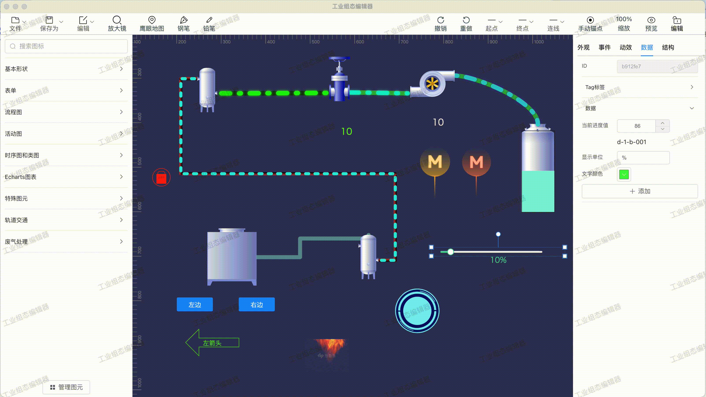
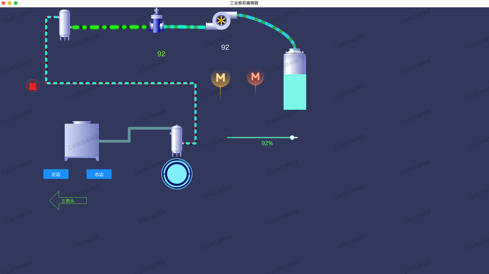
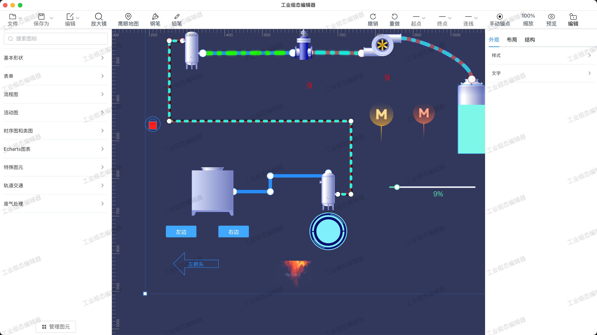
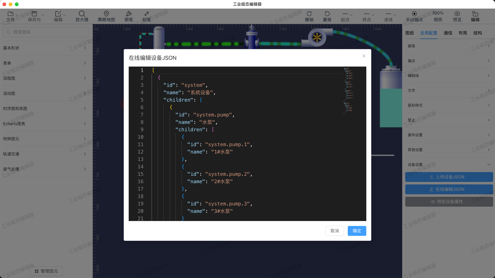
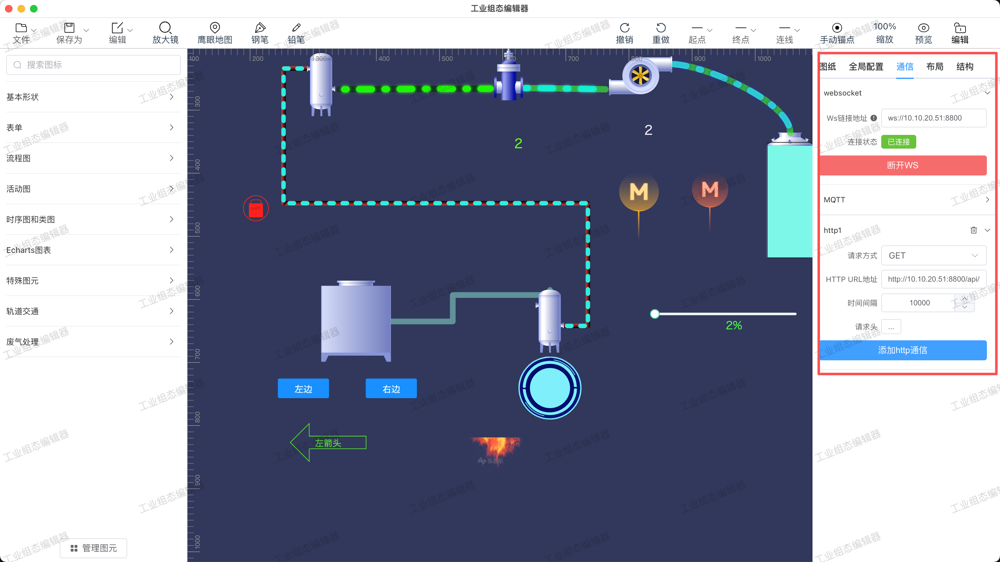
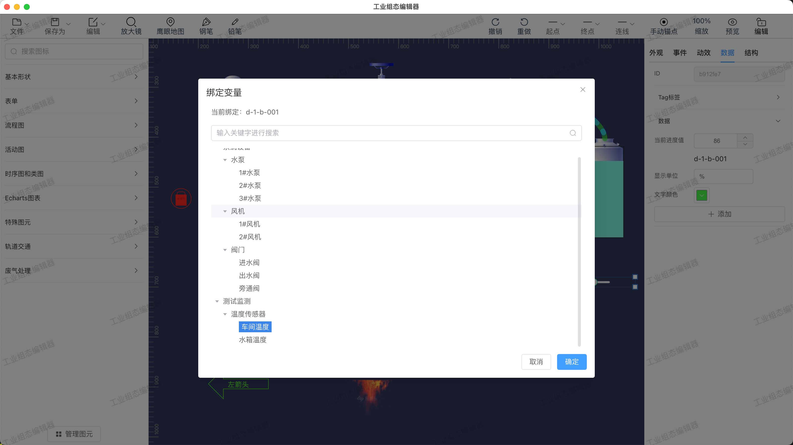

# GCS Designer 工业组态可视化编辑器

<a href="https://github.com/kami0314/gcs-designer.git" title="Release" target="_blank">

</a>
<a href="https://vuejs.org/" title="Vue" target="_blank">

</a>
<a href="https://vite.dev/" title="Vite" target="_blank">

</a>
<a href="https://www.electronjs.org/" title="Electron" target="_blank">

</a>
<a href="https://element-plus.org/" title="Element Plus" target="_blank">

</a>
<a href="./LICENSE" title="License" target="_blank">

</a>

## 简介

GCS Designer（Graphics Control System Designer）是一款开源的 **工业组态可视化编辑器**，基于 Vue 3 + Meta2d.js 构建，支持 Web 和 Electron 桌面双平台。面向工业监控、IoT 数据可视化场景，通过拖拽式操作即可完成监控界面的搭建，无需编码。

**核心理念：** 降低工业监控系统的开发门槛，提供免费开源的 Web 端组态方案替代昂贵的传统组态软件。

## 功能特性

- **图形编辑** - 拖拽式画布编辑，支持流程图、时序图、类图、表单图、故障树等多种图表类型
- **图元库** - 内置废气处理、轨道交通等工业 SVG 图元，支持自定义图标导入
- **属性配置** - 完整的右侧面板：外观样式、动画效果、事件响应、数据绑定等配置
- **通信模块** - 内置 WebSocket、MQTT、HTTP 三种通信方式，支持实时数据驱动
- **数据绑定** - 图元属性与实时数据源绑定，实现 IoT 设备状态的可视化监控
- **实时预览** - 一键切换预览模式，支持数据驱动渲染
- **本地存储** - Electron 桌面端支持项目文件本地读写，自动缓存
- **导出能力** - 支持导出为 JSON、SVG、PNG 格式
- **快捷操作** - 完整的撤销/重做、剪切/复制/粘贴、组合/锁定等编辑能力

## 核心技术栈

| 名称 | 版本 | 简介 |
|:---|:---|:---|
| <a href="https://vuejs.org/" target="_blank">Vue</a> | 3.4 | 渐进式 JavaScript 框架，易学易用，性能出色。 |
| <a href="https://vite.dev/" target="_blank">Vite</a> | 5.1 | 下一代前端工具链，为开发提供极速响应。 |
| <a href="https://www.typescriptlang.org/" target="_blank">TypeScript</a> | 5.4 | JavaScript 的超集，添加静态类型定义，提升代码可维护性。 |
| <a href="https://element-plus.org/" target="_blank">Element Plus</a> | 2.6 | 基于 Vue 3 的组件库，提供丰富的企业级 UI 组件。 |
| <a href="https://github.com/kami0314/gcs-designer.git" target="_blank">Meta2d.js</a> | 1.1.22 | 2D 图形编辑引擎，提供画布、图元、动画、事件等核心能力。 |
| <a href="https://www.electronjs.org/" target="_blank">Electron</a> | 42 | 使用 Web 技术构建跨平台桌面应用。 |
| <a href="https://microsoft.github.io/monaco-editor/" target="_blank">Monaco Editor</a> | 0.47 | VS Code 同款编辑器，用于 JSON/代码编辑。 |
| <a href="https://pinia.vuejs.org/" target="_blank">Pinia</a> | 2.1 | Vue 官方状态管理框架。 |
| <a href="https://router.vuejs.org/" target="_blank">Vue Router</a> | 4.3 | Vue 官方路由管理器。 |

## 快速开始

### 环境要求

- <a href="https://nodejs.org/" target="_blank">Node.js</a> >= 18
- <a href="https://pnpm.io/" target="_blank">pnpm</a> >= 8

### 开发调试

```bash
# 1. 克隆项目
git clone https://github.com/kami0314/gcs-designer.git.git

# 2. 安装依赖
pnpm install

# 3. 启动 Web 开发服务
pnpm dev

# 4. 启动 Electron 桌面端开发
pnpm electron:dev
```

### 构建打包

```bash
# 构建 Web 产物
pnpm build

# 打包 Electron Windows 安装包
pnpm electron:build:win

# 打包 Electron Mac 安装包
pnpm electron:build:mac

# 同时打包 Windows + Mac
pnpm electron:build:all
```

## 项目结构

```
gcs-designer
├── electron/                    # Electron 主进程
│   ├── main.cjs                 # 主进程入口（窗口、菜单、IPC、文件读写）
│   └── preload.cjs              # 预加载脚本（安全暴露 API）
├── src/
│   ├── api/                     # 接口定义
│   ├── assets/                  # 静态资源（字体、样式、Logo）
│   ├── components/              # 组件
│   │   ├── Form.vue             # 动态表单渲染引擎
│   │   ├── Meta2d.vue           # Meta2d 画布核心组件
│   │   ├── Nav.vue              # 顶部导航栏（菜单、缩放、预览）
│   │   ├── Header.vue           # 头部布局
│   │   ├── Aside.vue            # 左侧图元面板
│   │   ├── Setting.vue          # 右侧属性设置面板
│   │   ├── RightMenu.vue        # 右键菜单
│   │   ├── Icons.vue            # 图元图标库
│   │   ├── MonacoEditor.vue     # Monaco 编辑器封装
│   │   ├── EditDialog.vue       # 代码编辑弹窗
│   │   ├── GColorPicker.vue     # 颜色选择器
│   │   ├── MapProps/            # 图纸属性面板
│   │   │   ├── Map.vue          # 基础属性（画布尺寸、颜色）
│   │   │   ├── Global.vue       # 全局配置（主题、禁用项）
│   │   │   ├── Correspondence.vue # 通信配置（WS/MQTT/HTTP）
│   │   │   ├── Construction.vue # 结构配置
│   │   │   └── Layout.vue       # 布局配置
│   │   └── PenProps/            # 图元属性面板
│   │       ├── Appearance.vue   # 外观样式
│   │       ├── Animate.vue      # 动画配置
│   │       ├── Event.vue        # 事件绑定
│   │       └── DataBind.vue     # 数据绑定
│   ├── config/                  # 配置文件
│   │   ├── defaultConfig.ts     # 默认属性配置
│   │   ├── defaultNav.ts        # 导航栏菜单配置
│   │   ├── defaultIcon.ts       # 默认图标库
│   │   └── appearance/          # 外观配置生成器
│   ├── hooks/                   # 组合式函数
│   │   └── useNetwork.ts        # 网络通信（WS/MQTT/HTTP）
│   ├── router/                  # 路由配置
│   ├── stores/                  # Pinia 状态管理
│   ├── types/                   # TypeScript 类型定义
│   ├── utils/                   # 工具函数
│   │   ├── messageHandler.ts    # 实时消息解析与分发
│   │   └── render.ts            # 渲染批处理优化
│   ├── views/                   # 页面视图
│   │   ├── Edit.vue             # 编辑页面
│   │   └── Preview.vue          # 预览页面
│   ├── App.vue                  # 根组件
│   └── main.ts                  # 应用入口
├── vite.config.ts               # Vite 构建配置
├── package.json                 # 项目配置与依赖
└── LICENSE                      # MIT 开源协议
```

## 操作指南

### 一、页面编辑

1. **进入编辑模式** - 启动后默认进入预览页面，若无项目文件会提示"未找到项目文件"。点击"点击创建"按钮或使用快捷键 `Ctrl/Cmd + Y` 切换到编辑页面。
2. **选择图元** - 左侧面板提供图形库（基础图形、流程图、工业图元等），将所需图元拖拽到画布上。
3. **配置属性** - 选中图元后，右侧面板可配置：
   - **外观** - 位置、尺寸、颜色、边框、圆角、透明度、文字样式等
   - **动画** - 为图元添加帧动画、线条动画、状态过渡等效果
   - **事件** - 绑定鼠标点击、移入、移出等事件，触发链接跳转、页面切换等行为
   - **数据** - 添加数据属性并绑定设备变量，实现数据驱动的可视化更新
4. **画布操作** - 支持网格/标尺辅助对齐，右键菜单提供图层调整、组合/锁定、撤销/重做等操作。
5. **保存项目** - 通过顶部菜单"文件 > 保存项目"或 `Ctrl/Cmd + S` 保存。Electron 桌面端会自动存储到本地用户数据目录。

### 二、数据通信配置

要实现后台数据实时驱动图元变化，需完成以下三步配置：

#### 第 1 步：配置设备变量

在右侧面板切换到 **图纸** 标签页，展开 **全局配置** 中的"设备设置"，点击编辑按钮打开 Monaco 编辑器，定义设备变量 JSON。每个变量需包含唯一标识（如 `dataId`），后续绑定时使用。

#### 第 2 步：配置通信方式

在 **通信** 标签页中选择并配置通信方式：

| 通信方式 | 说明 | 数据来源 |
|:---|:---|:---|
| **WebSocket** | 长连接，后台主动推送实时数据 | 适合高频更新场景（如设备状态监控） |
| **MQTT** | 基于 WebSocket 的 MQTT 协议 | 适合 IoT 设备消息订阅 |
| **HTTP** | 定时轮询，按指定间隔请求接口 | 适合低频更新场景，支持自定义请求头 |

通信接口返回的 JSON 数据需符合以下标准格式（支持单条或数组批量）：

```jsonc
// 方式一：按变量绑定更新（推荐）
{ "dataId": "d-1-b-001", "value": "80" }

// 方式二：按图元 ID 直接更新属性
{ "id": "pen-id-xxx", "text": "运行中", "color": "#00ff00" }

// 批量更新
[
  { "dataId": "d-1-b-001", "value": "80" },
  { "dataId": "d-1-b-002", "value": "正常" }
]
```

#### 第 3 步：绑定图元数据

1. 选中画布上的图元，切换到右侧 **数据** 面板
2. 点击"添加数据"按钮，为图元添加可绑定的数据属性（如文字、颜色、进度值等）
3. 点击属性右侧的 **链接图标**，在弹出的设备变量列表中选择对应的变量完成绑定
4. 绑定完成后，通信接口返回的 `dataId` 与 `value` 会自动映射到图元的对应属性上

**示例：** 将一个文本图元的文字属性绑定到变量 `d-1-b-001`，当后台推送 `{"dataId":"d-1-b-001","value":"80"}` 时，该图元的文字会自动更新为 "80"。

### 三、预览与导出

- **预览模式** - 点击导航栏右侧的"预览"按钮或按 `Ctrl/Cmd + Y`，进入全屏预览。预览模式下画布不可编辑，通信连接自动生效，可实时观察数据驱动效果。
- **导出文件** - 通过顶部菜单"文件"可导出为：
  - **JSON** - 项目配置文件，可用于导入恢复
  - **SVG** - 矢量图形，适合嵌入 Web 页面
  - **PNG** - 位图截图，适合文档或分享

### 四、常用快捷键

| 快捷键 | 功能 |
|:---|:---|
| `Ctrl/Cmd + Y` | 切换编辑/预览模式 |
| `Ctrl/Cmd + Z` | 撤销 |
| `Ctrl/Cmd + Shift + Z` | 重做 |
| `Ctrl/Cmd + C` | 复制选中图元 |
| `Ctrl/Cmd + V` | 粘贴 |
| `Ctrl/Cmd + X` | 剪切 |
| `Ctrl/Cmd + A` | 全选 |
| `Ctrl/Cmd + S` | 保存项目 |
| `Delete` | 删除选中图元 |

## 系统截图

<table>
  <tbody>
    <tr>
      <td align="center"></td>
    </tr>
    <tr>
      <td align="center"><b>画布交互演示</b></td>
    </tr>
    <tr>
      <td align="center"></td>
    </tr>
    <tr>
      <td align="center"><b>预览页面</b></td>
    </tr>
    <tr>
      <td align="center"></td>
    </tr>
    <tr>
      <td align="center"><b>画布编辑页</b></td>
    </tr>
    <tr>
      <td align="center"></td>
    </tr>
    <tr>
      <td align="center"><b>设备变量配置（Monaco Editor）</b></td>
    </tr>
    <tr>
      <td align="center"></td>
    </tr>
    <tr>
      <td align="center"><b>通信协议配置（WebSocket / MQTT / HTTP）</b></td>
    </tr>
    <tr>
      <td align="center"></td>
    </tr>
    <tr>
      <td align="center"><b>图元数据绑定</b></td>
    </tr>
  </tbody>
</table>

## 参与贡献

欢迎为 GCS Designer 贡献代码、提交 Issue 或提出建议。


## 鸣谢

- <a href="https://element-plus.org/" target="_blank">Element Plus</a> - Vue 3 组件库
- <a href="https://le5le.com/" target="_blank">le5le</a> - Meta2d.js 开发团队

## License

- 遵循 <a href="./LICENSE" target="_blank">MIT</a> 开源许可协议
- Copyright © 2026-present GCS Designer
